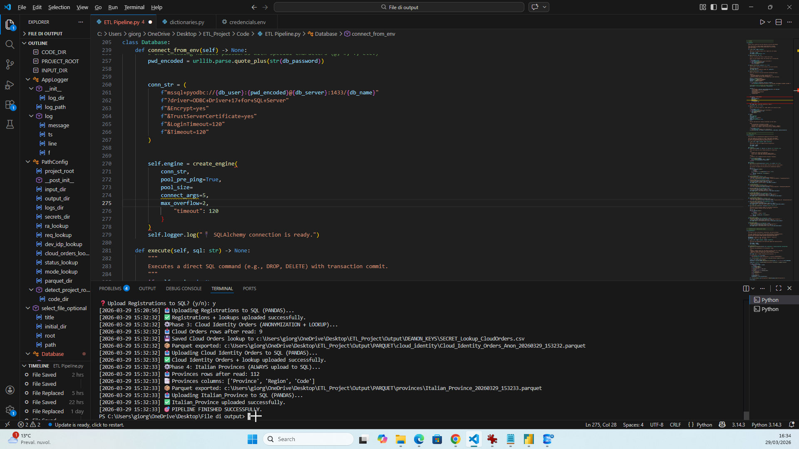
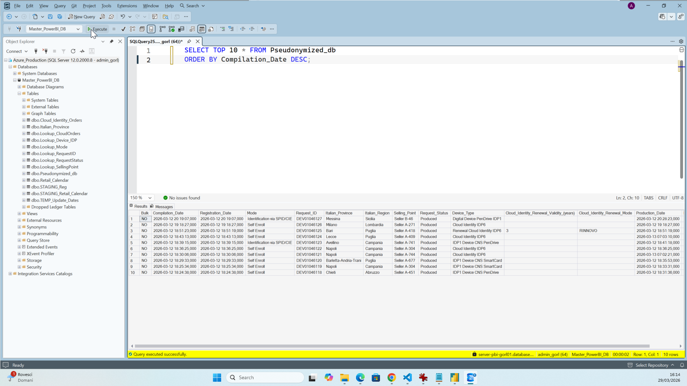
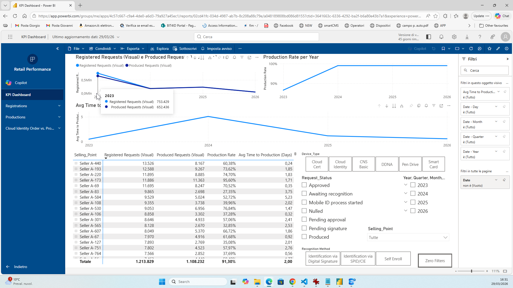

# 📊 Retail Data Pipeline: ETL & Automated Analytics

An enterprise-grade Data Engineering solution designed to automate the ingestion, reconciliation, and cloud-loading of retail datasets. This pipeline ensures **GDPR compliance** through robust pseudonymization and provides a **Single Source of Truth** for business analytics via Azure SQL and Power BI.

---

## 🚀 Key Architectural Features & Execution

> **The pipeline acts as a central control hub, managing the workflow from local file ingestion to cloud data warehouse synchronization.**

*(Figure 1: [View script logic](Code/) showing the modular project structure and real-time execution logs.)*

* **Hybrid ETL Engine**: Optimized performance using [Polars](https://pola.rs/) for fast transformations and [Pandas](https://pandas.pydata.org/) for SQL integration.
* **Business Logic Reconciliation**: Implements advanced **Data Precedence** rules to synchronize discordant timestamps from multiple systems.
* **GDPR-Compliant Masking**: Automated pseudonymization of sensitive entities using persistent local lookup stores.

## ☁️ Cloud Integration & SQL Schema

> **The processed data is synchronized with an [Azure SQL Database](https://azure.microsoft.com/en-us/products/azure-sql/database/), following a Star Schema architecture.**

*(Figure 2: SQL Server Management Studio showing the relational schema and Fact tables.)*

* **Transactional Integrity**: Uses staging-to-production MERGE patterns to prevent duplicates.
* **Optimized Indexing**: Structured for rapid filtering by Date, Province, and Pseudonymized IDs.

## 🛠 Tech Stack

* **Language**: [Python 3.14+](https://www.python.org/)
* **Core Libraries**: Polars, Pandas, [SQLAlchemy](https://www.sqlalchemy.org/), Dotenv.
* **Database**: Azure SQL Database.
* **Visualization**: [Power BI Service](https://powerbi.microsoft.com/).
* **Storage**: Local Snappy-compressed Parquet.

## 🌐 Cloud Distribution: Power BI Web App

> **The final analytical layer is deployed as a Power BI Service App for business stakeholders.**

*(Figure 3: The live Power BI Web App interface fed by the automated Azure SQL pipeline.)*

## 🔒 Security & Best Practices

* **Zero-Trust Credential Management**: Credentials are injected via protected `.env` files (excluded via [.gitignore](.gitignore)).
* **Data Leakage Prevention**: Comprehensive security rules to keep raw data and keys strictly local.
* **Resilient Execution**: Features a "Smart Append" logic to optimize cloud resources.

---
**Author**: [Giorgio Orlando](https://www.linkedin.com/in/tuo-profilo-qui)  
**Target**: Data Engineering Portfolio / Enterprise Integration